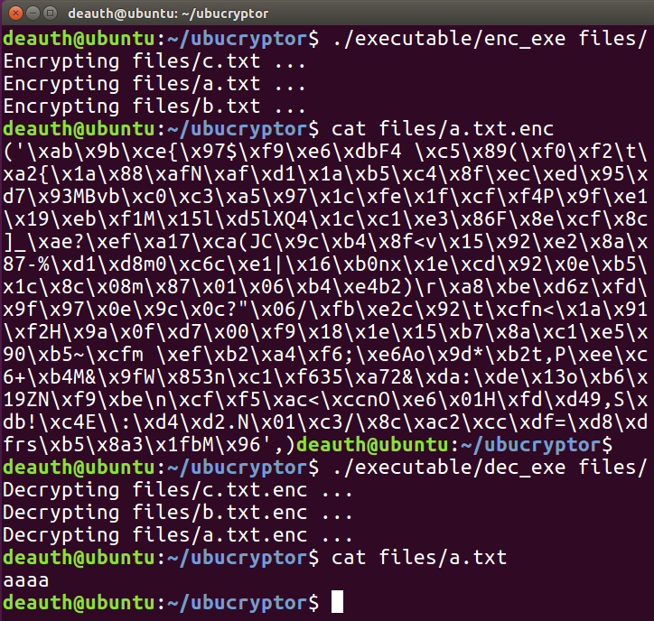

# ubucryptor
Encrypting and decrypting files in Ubuntu. Encrypting the same file extensions than Wannacry 

## Usage

#### Encrypt files:

```
python enc.py $directory
```

#### Decrypt files:

```
python dec.py $directory
```

## Or create executable files

```
cat enc.py crypto.py >> temp_enc.py && pyinstaller -F temp_enc.py && rm temp_enc.py

cat dec.py crypto.py >> temp_dec.py && pyinstaller -F temp_dec.py && rm temp_dec.py
```

## Example




## Requirements

```
sudo pip install pyinstaller
```

